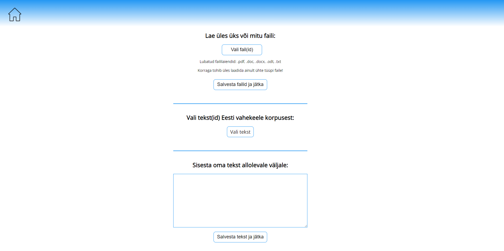
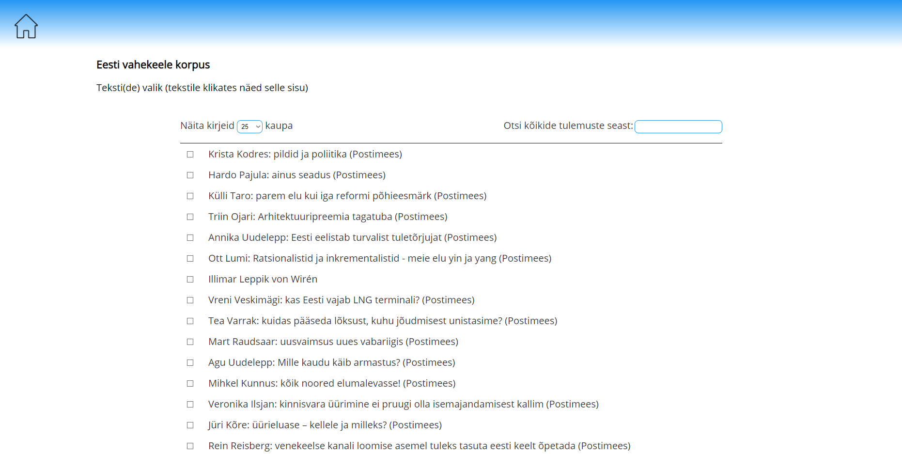
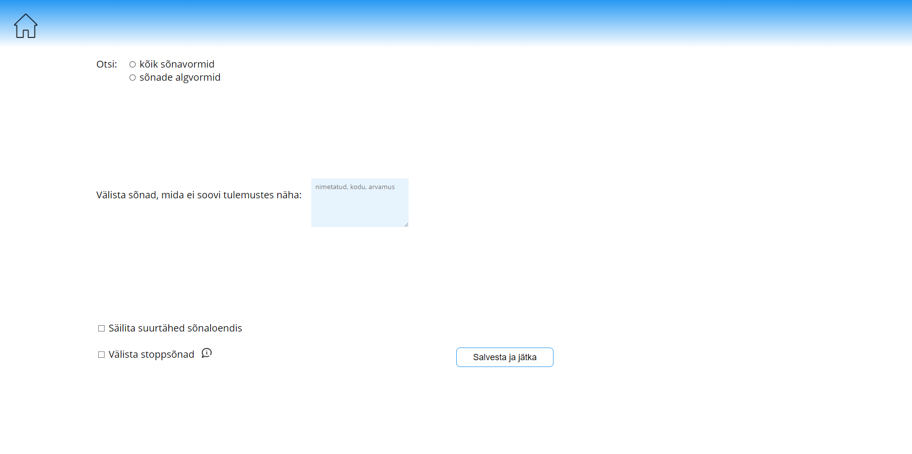
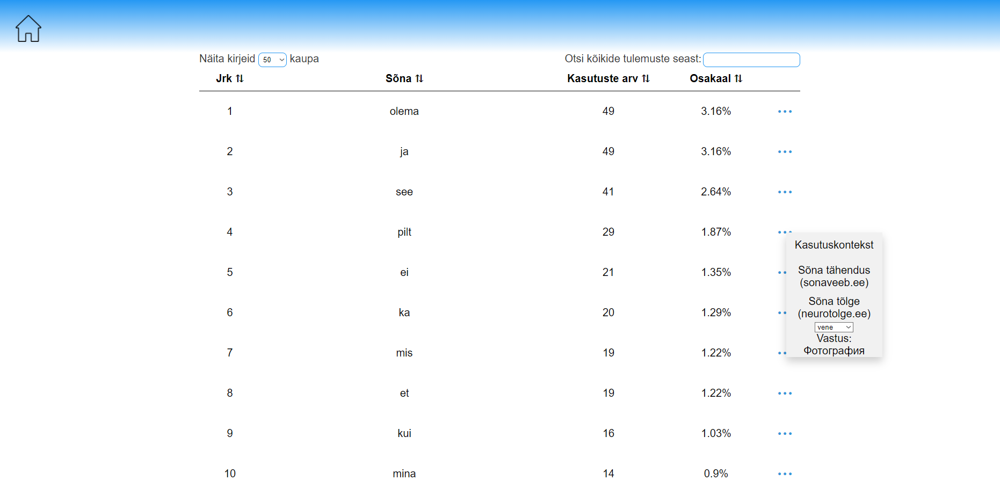
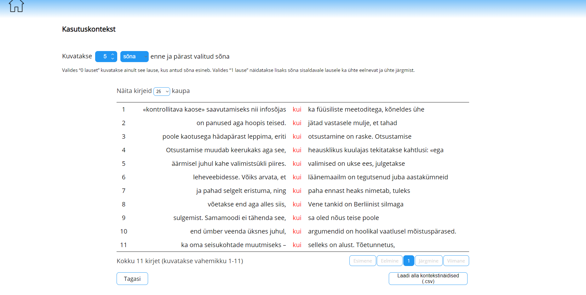

# Veebirakendus sõnade sageduse ja kasutusnäidete leidmiseks

## Eesmärk ja lühikirjeldus

Meie projekti eesmärgiks on luua veebipõhine teenus, mis võimaldab leida sõnade algvorme, sõnade sagedusloendit (arvuliselt ja protsentuaalselt), sõnade kasutuskontekste erinevate filtreerimisvõimalustega, sõna tähendust ja tõlget mõnes muus keeles. Tekstist saab välja filtreerida nii omal valikul sõnu (kirjutades need sobivasse lahtrisse) kui ka ühe nupuvajutusega kõik stoppsõnad ehk kõige tüüpilisemad sõnad, mida esineb tekstis rohkelt kuid mis ei anna sisulist tähendust ning rikuvad analüüsitulemusi.  
Analüüsitavaid tekste saab üles laadida failina, kopeerida/kirjutada tekstilahtrisse või valida Eesti vahekeele korpuse tekstikogumikust sobiv tekst. Nii kasutuskonteksti kui ka sõnaloendi väljundit on võimalik failina alla laadida.  
Kõige all on näha mõningad ekraanipildid rakendusest.  
Rakendus kasutab MIT litsentsi mille kohta saab lisainfot LICENSE failist projekti root kataloogis.

## Projektist

Projekt valmis Tallinna Ülikooli informaatika bakalaureuseõppe aine 'Tarkvaraarenduse projekt (IFI6231.DT)' raames. Arendusprotsess leidis aset 2021 juunikuus 2 nädala jooksul; varasem kavandamine, prototüüpimine jms leidis aset kevadsemestri vältel teistes ainetes. Projektiga tegeles neljaliikmeline tudengite grupp, lisaks aitasid ning panustasid nõu ja jõuga erinevad õppejõud.  
Ülikooli keeleteadlastel, õppijatel ja õpetajatel puudus korralik rakendus, mis aitab neil teha lihtsamaid tekstide analüüse. On rakendusi, mis täidavad ühe või mingi osa soovitavast funktsionaalsusest, kuid puudu on just see, millega saaks kõike koos, lihtsasti ja mugavalt teha. Sellest ka projekti idee ja teostus.

## Kasutatud tehnoloogiad koos versioonidega

* HTML5
* CSS3
* JavaScript ECMAScript 2018
* Java JDK 11
* Python 3.8.5

## Autorid/panustajad

* Harli Kodasma
* Klaus Martin Vare
* Kirke Liis Paur
* Ekke Alar Toomingas
* õppejõud Jaagup Kippar

## Paigaldusjuhis

1. EVKK portaal tuleb kloonida ja käima panna vastavalt readme failile: https://github.com/centre-for-educational-technology/evkk
2. Lisa EVKK portaali failide hulka siin repositooriumis olevad failid (osasid faile tuleb üle kirjutada ning see on korrektne). Screenshotide kaust ei ole vajalik!
3. Kuna see repositoorium lisab andmebaasi andmeid mida seal enne pole, siis peale failide ühendamist tuleb uuesti andmebaas migreerida: `:db:bootRun --args 'clean migrate seed'` (sama käsk on toodud välja EVKK readmes).
4. Pythonile tuleb installeerida Stanza moodul (näiteks pip'i kaudu `pip install stanza`) (https://stanfordnlp.github.io/stanza/) ning kas käsitsi terminalist või lihtsa Python scripti abil jooksutada käsk `stanza.download('et')` mis laeb moodulile alla eesti keele paki. NB! Pythoni scripte jooksutab Java mis omakorda käivitab neid root kasutaja õigustest. Pythoni moodulid aga on kasutajapõhised ehk Stanza tuleb installeerida root kasutajana, vastasel korral moodulit ei leita.
5. Seejärel asub meie rakendus EVKK portaalis aadressil /home.html (ehk siis tõenäoliselt localhost:3000/home.html)

## Ekraanipildid rakendusest

Siin on välja toodud vaid mõned ekraanipildid rakendusest.

### Rakenduse avaleht

### EVKKst tekstide pärimisel kuvatav tekstiloend

### Filtrite rakendamine peale teksti valimist

### Sõnaloendi kuvamise vaade koos ühe avatud menüüga ning sealt tõlke nägemisega

### Valitud sõna kohta kasutuskontekstide kuvamine

